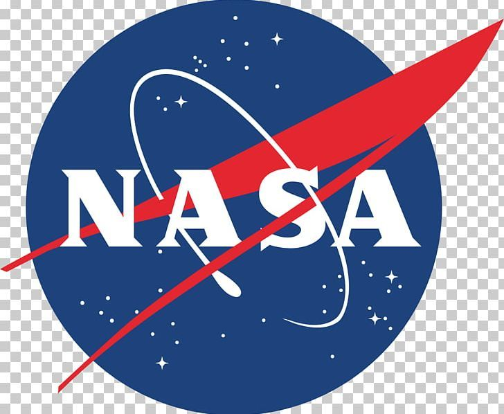
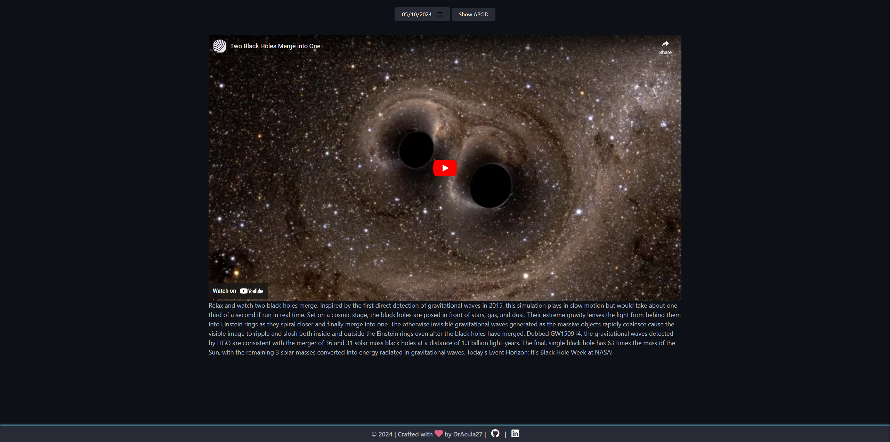

<!-- Improved compatibility of back to top link: See: https://github.com/othneildrew/Best-README-Template/pull/73 -->

<!-- PROJECT LOGO -->
 

  

  <h3 align="center">Star Gazers - Astronomy Picture of the Day</h3>

  

    Browse all of NASA's Astronomy Pictures of the Day, from June 16, 1995 til today!
     
    <a href="https://dracula27.github.io/starGazersAPOD/">View Demo</a>

<!-- TABLE OF CONTENTS -->

  
Table of Contents

  <ol>
    <li>
      <a href="#about-the-project">About The Project</a>
      <ul>
        <li><a href="#built-with">Built With</a></li>
      </ul>
    </li>
    <li><a href="#usage">Usage</a></li>
    <li><a href="#contact">Contact</a></li>
    <li><a href="#acknowledgments">Acknowledgments</a></li>
  </ol>

<!-- ABOUT THE PROJECT -->

## About The Project

Have you ever wondered what the night sky looked like on a certain day? Maybe even today?

Look no further! With this app, you can view the universe through NASA. Browse through their daily astronomy pictures to your heart's content!

(<a href="#readme-top">back to top</a>)

### Built With

<!-- - 
-  -->
<!-- - [JavaScript]() -->

- HTML
- CSS
- JavaScript

(<a href="#readme-top">back to top</a>)

<!-- USAGE -->

## Usage

Use this space to show useful examples of how a project can be used. Additional screenshots, code examples and demos work well in this space. You may also link to more resources.

(<a href="#readme-top">back to top</a>)

<!-- CONTACT -->

## Contact

Danielle Andrews - [@DrAcula_codes](https://twitter.com/DrAcula_codes 'Twitter/X') - [daniellerandrews](https://www.linkedin.com/in/daniellerandrews 'LinkedIn') - danielle.andrews.dev@icloud.com

Project Link: [https://github.com/DrAcula27/starGazersAPOD](https://github.com/DrAcula27/starGazersAPOD)

(<a href="#readme-top">back to top</a>)

<!-- ACKNOWLEDGMENTS -->

## Acknowledgments

A special thanks to these resources used in the project!

- [NASA APIs](https://api.nasa.gov)
- [GitHub Pages](https://pages.github.com)
- [Font Awesome](https://fontawesome.com)

(<a href="#readme-top">back to top</a>)

